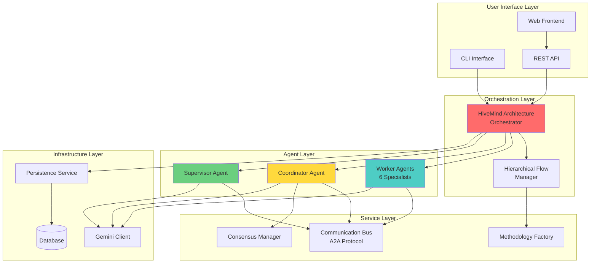
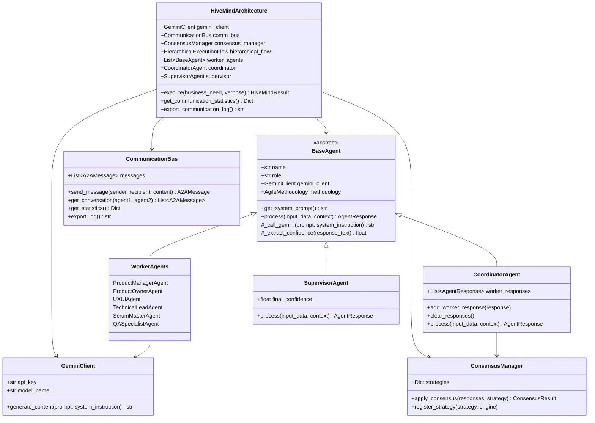
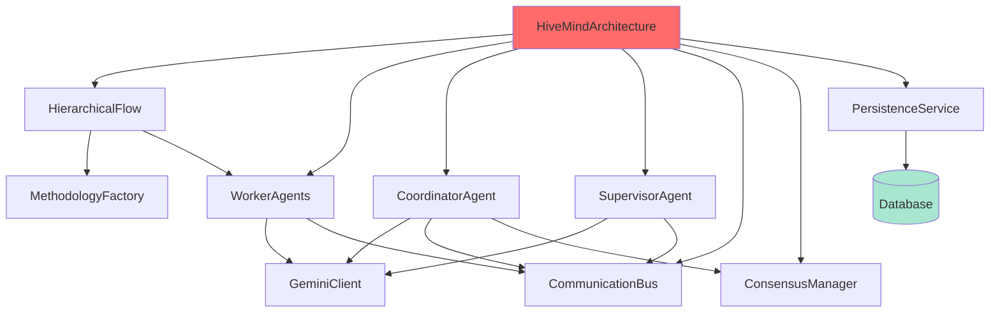

# Logical View - HiveMind Architecture

## Overview

The **Logical View** describes the system's functionality in terms of components, their responsibilities, and relationships. This view is primarily concerned with **what** the system does and how it is logically structured to fulfill its requirements.

**Target Audience**: Software Architects, Technical Leads, Senior Developers

---

## Table of Contents

1. [Functional Decomposition](#functional-decomposition)
2. [Component Architecture](#component-architecture)
3. [Layer Architecture](#layer-architecture)
4. [Component Catalog](#component-catalog)
5. [Design Patterns](#design-patterns)
6. [Component Relationships](#component-relationships)
7. [Data Models](#data-models)

---

## Functional Decomposition

### High-Level Functional Areas

The HiveMind system is decomposed into five major functional areas:



---

## Component Architecture

### Core Components Overview



---

## Layer Architecture

### Five-Layer Architecture

The system follows a strict layered architecture with well-defined responsibilities:

#### Layer 1: User Interface Layer
**Responsibility**: Provide interfaces for user interaction

**Components**:
- **CLI (Command Line Interface)**: Direct command-line access
- **REST API (FastAPI)**: HTTP/WebSocket endpoints
- **Web Frontend (React)**: Browser-based UI

**Dependencies**: → Orchestration Layer

#### Layer 2: Orchestration Layer
**Responsibility**: Coordinate execution flow and manage lifecycle

**Components**:
- **HiveMindArchitecture**: Main orchestrator
- **HierarchicalExecutionFlow**: Manages sequential execution with dependencies

**Dependencies**: → Agent Layer, Service Layer

#### Layer 3: Agent Layer
**Responsibility**: Domain-specific analysis and decision-making

**Components**:
- **6 Worker Agents**: Specialized domain experts
- **1 Coordinator Agent**: Synthesis and integration
- **1 Supervisor Agent**: Final authority

**Dependencies**: → Service Layer, Infrastructure Layer

#### Layer 4: Service Layer
**Responsibility**: Cross-cutting concerns and shared services

**Components**:
- **CommunicationBus**: Agent messaging (A2A protocol)
- **ConsensusManager**: Decision-making strategies
- **MethodologyFactory**: Methodology adaptation

**Dependencies**: → Infrastructure Layer

#### Layer 5: Infrastructure Layer
**Responsibility**: External integrations and persistence

**Components**:
- **GeminiClient**: LLM API wrapper
- **PersistenceService**: Database abstraction
- **Database**: PostgreSQL storage

**Dependencies**: → External Services

---

## Component Catalog

### 1. HiveMindArchitecture

**Type**: Orchestrator
**Responsibility**: Main system orchestrator that manages the complete execution flow

**Key Responsibilities**:
- Initialize and coordinate all agents
- Execute three-level hierarchical process
- Manage communication bus
- Apply consensus mechanisms
- Persist results to database
- Generate execution reports

**Interfaces**:
```python
class HiveMindArchitecture:
    def execute(
        business_need: str,
        verbose: bool = True
    ) -> HiveMindResult

    def get_communication_statistics() -> Dict[str, Any]

    def export_communication_log() -> str

    def get_agent_info() -> Dict[str, List[Dict[str, str]]]
```

**Configuration**:
- `gemini_client`: LLM client instance
- `methodology`: Agile methodology (Scrum/SAFe/Kanban)
- `consensus_strategy`: Consensus mechanism to apply

---

### 2. BaseAgent (Abstract)

**Type**: Abstract Base Class
**Responsibility**: Define common interface for all agents

**Key Responsibilities**:
- Define agent contract
- Provide Gemini API integration
- Support methodology adaptation
- Generate structured responses
- Log agent activities

**Abstract Methods**:
```python
@abstractmethod
def get_system_prompt() -> str

@abstractmethod
def process(
    input_data: str,
    context: Optional[Dict[str, Any]] = None
) -> AgentResponse
```

**Concrete Methods**:
- `_call_gemini()`: Execute LLM call
- `_extract_confidence()`: Parse confidence score
- `_create_response()`: Generate AgentResponse
- `get_adapted_system_prompt()`: Methodology-aware prompt

---

### 3. Worker Agents (6 Specialists)

#### 3.1 ProductManagerAgent
**Domain**: Business Analysis & Strategy

**Responsibilities**:
- Business viability assessment
- Market analysis
- ROI estimation
- Stakeholder identification
- KPI definition
- Success metrics

**Output Structure**:
- Business objectives
- Target market analysis
- Competitive landscape
- Financial projections
- Risk assessment

---

#### 3.2 ProductOwnerAgent
**Domain**: Product Definition & Backlog

**Responsibilities**:
- User story creation (INVEST criteria)
- Product backlog definition
- Feature prioritization
- Acceptance criteria
- Epic decomposition

**Output Structure**:
- Epics and user stories
- Product backlog (prioritized)
- Acceptance criteria
- Story point estimates
- Release planning

---

#### 3.3 UXUIAgent
**Domain**: User Experience & Interface Design

**Responsibilities**:
- User journey mapping
- Wireframe concepts
- Design system recommendations
- Accessibility requirements
- Usability heuristics

**Output Structure**:
- User personas
- Journey maps
- Wireframe descriptions
- Design system guidelines
- Accessibility checklist

---

#### 3.4 TechnicalLeadAgent
**Domain**: Architecture & Technology

**Responsibilities**:
- System architecture (C4 model)
- Technology stack recommendations
- Non-functional requirements
- Design patterns
- Technical constraints

**Output Structure**:
- Architecture diagrams (C4)
- Technology stack
- NFRs (performance, security, scalability)
- Design patterns
- Technical dependencies

---

#### 3.5 ScrumMasterAgent
**Domain**: Process & Risk Management

**Responsibilities**:
- Sprint planning
- Ceremony definitions
- RAID log (Risks, Assumptions, Issues, Dependencies)
- Definition of Ready/Done
- Release planning

**Output Structure**:
- Sprint structure
- Ceremony schedule
- RAID analysis
- DoR/DoD criteria
- Release roadmap

---

#### 3.6 QASpecialistAgent
**Domain**: Quality Assurance & Testing

**Responsibilities**:
- Test strategy definition
- Coverage requirements
- Test automation approach
- Quality gates
- Defect management

**Output Structure**:
- Test strategy
- Test pyramid definition
- Automation framework
- Quality metrics
- Bug tracking approach

---

### 4. CoordinatorAgent

**Type**: Integration Agent
**Responsibility**: Synthesize worker outputs and resolve conflicts

**Key Responsibilities**:
- Integrate 6 worker analyses
- Identify synergies
- Detect and resolve conflicts
- Apply consensus mechanism
- Generate integrated synthesis

**Input**:
- Business need
- 6 worker responses

**Output**:
- Integrated synthesis
- Conflict resolution report
- Consensus result
- Recommendations

**Algorithms**:
- Conflict detection via keyword analysis
- Resolution through methodology guidelines
- Synthesis via LLM integration

---

### 5. SupervisorAgent

**Type**: Authority Agent
**Responsibility**: Make final decisions and generate complete requirements

**Key Responsibilities**:
- Evaluate coordinator synthesis
- Validate completeness
- Ensure viability
- Generate final technical requirements document
- Apply final authority

**Input**:
- Business need
- Coordinator synthesis
- Consensus results

**Output**:
- Complete technical requirements document (JSON)
- Executive summary
- Implementation recommendations
- Final confidence score (0.95 default)

**Output Schema**:
```json
{
  "document_metadata": {...},
  "executive_summary": {...},
  "business_requirements": {...},
  "functional_requirements": {...},
  "non_functional_requirements": {...},
  "technical_specifications": {...},
  "ux_ui_requirements": {...},
  "quality_assurance": {...},
  "implementation_plan": {...},
  "risks_and_mitigation": [...]
}
```

---

### 6. CommunicationBus

**Type**: Messaging Service
**Responsibility**: Agent-to-Agent communication protocol

**Key Responsibilities**:
- Route messages between agents
- Maintain message history
- Support message threading (parent-child)
- Provide communication analytics
- Export communication logs

**Message Types**:
- `REQUEST`: Request for action
- `RESPONSE`: Response to request
- `NOTIFICATION`: Informational message
- `ERROR`: Error notification

**Message Priority**:
- `HIGH`: Critical messages (coordinator, supervisor)
- `MEDIUM`: Normal messages (workers)
- `LOW`: Informational messages

**A2A Message Structure**:
```python
class A2AMessage:
    message_id: str
    sender: str
    recipient: str
    message_type: MessageType
    priority: MessagePriority
    content: str
    metadata: Dict[str, Any]
    timestamp: str
    parent_message_id: Optional[str]
```

---

### 7. ConsensusManager

**Type**: Decision Service
**Responsibility**: Apply consensus strategies to agent responses

**Consensus Strategies**:

#### 7.1 Weighted Voting (Default)
```python
consensus = Σ(confidence_i × weight_i) / Σ(weight_i)

weights = {
    "ProductManager": 1.2,
    "ProductOwner": 1.1,
    "UXUI_Designer": 1.0,
    "ScrumMaster": 0.9,
    "TechnicalLead": 1.3,
    "QA_Specialist": 1.0
}
```

#### 7.2 Majority Consensus
```python
agreeing_agents = [a for a in agents if a.confidence >= threshold]
consensus_achieved = len(agreeing_agents) / len(agents) > 0.5
```

#### 7.3 Unanimous Consensus
```python
consensus_achieved = all(a.confidence >= threshold for a in agents)
```

#### 7.4 Confidence Threshold
```python
avg_confidence = mean([a.confidence for a in agents])
consensus_achieved = avg_confidence >= threshold
```

#### 7.5 Iterative Refinement
```python
# Experimental strategy for iterative improvement
# Multiple rounds of agent processing with feedback loops
initial_responses = collect_agent_responses()
for iteration in range(max_iterations):
    if consensus_achieved(initial_responses):
        break
    feedback = generate_feedback(initial_responses)
    refined_responses = refine_with_feedback(feedback)
    initial_responses = refined_responses
```

**Note**: This strategy is available in the codebase but currently experimental. It enables multiple rounds of refinement when initial consensus is not achieved.

**Output**:
```python
class ConsensusResult:
    achieved: bool
    strategy_used: ConsensusStrategy
    consensus_level: float
    selected_responses: List[AgentResponse]
    conflicting_responses: List[AgentResponse]
    justification: str
    metadata: Dict[str, Any]
```

---

### 8. HierarchicalExecutionFlow

**Type**: Flow Manager
**Responsibility**: Manage sequential execution with dependencies

**Execution Phases**:
1. **Business Foundation**: ProductManager (no dependencies)
2. **Product Definition**: ProductOwner (depends on phase 1)
3. **User Experience**: UX/UI Designer (depends on phase 2)
4. **Technical Foundation**: Technical Lead (depends on phase 3)
5. **Process Optimization**: Scrum Master (depends on phase 4)
6. **Quality Assurance**: QA Specialist (depends on phase 5)

**Key Features**:
- Explicit dependency management
- Context preservation between phases
- Quality gates at each phase
- Methodology-aware execution

**Phase Context Structure**:
```python
{
    "phase": "technical_foundation",
    "methodology": "scrum",
    "methodology_context": "...",
    "dependencies": [
        {
            "phase": "user_experience",
            "agent": "UXUI_Designer",
            "confidence": 0.87,
            "content": "..."
        }
    ],
    "previous_responses": [...]
}
```

---

### 9. MethodologyFactory

**Type**: Adaptation Service
**Responsibility**: Provide methodology-specific contexts

**Supported Methodologies**:
- **Scrum**: Sprint-based, Product Owner led
- **SAFe**: Portfolio/Program/Team structure
- **Kanban**: Continuous flow, WIP limits

**Methodology Context**:
```python
class MethodologyContext:
    name: AgileMethodology
    description: str
    roles: Dict[str, str]  # Role mappings
    artifacts: List[str]   # Expected deliverables
    ceremonies: List[str]  # Process events
    terminology: Dict[str, str]  # Glossary
```

**Adaptation Features**:
- Prompt adaptation per methodology
- Output format adaptation
- Role mapping
- Artifact customization

---

### 10. GeminiClient

**Type**: External API Client
**Responsibility**: Interface with Google Gemini API

**Key Responsibilities**:
- Execute LLM API calls
- Handle rate limiting
- Implement retry logic
- Manage token limits
- Log API interactions

**Configuration**:
- `api_key`: Google API key
- `model_name`: Gemini model (e.g., "gemini-1.5-pro")
- `temperature`: Creativity control (0.0-1.0)
- `max_tokens`: Output limit
- `timeout`: Request timeout

**Features**:
- Exponential backoff retry
- Error handling and recovery
- Token counting and management
- Response parsing

---

### 11. PersistenceService

**Type**: Data Access Service
**Responsibility**: Database abstraction for persistence

**Key Responsibilities**:
- Save analysis results
- Store agent responses
- Query historical data
- Manage database connections

**Database Models**:

#### Analysis Model
```python
class Analysis:
    id: int (primary key)
    business_need: str
    methodology: str
    consensus_strategy: str
    execution_time: float
    consensus_level: float
    final_confidence: float
    created_at: datetime
    results_json: JSON
```

#### AgentResponse Model
```python
class AgentResponse:
    id: int (primary key)
    analysis_id: int (foreign key)
    agent_name: str
    agent_role: str
    confidence: float
    content: Text
    metadata: JSON
    created_at: datetime
```

**Operations**:
- `save_analysis()`: Persist complete analysis
- `get_analysis()`: Retrieve by ID
- `list_analyses()`: Get history with filters
- `delete_analysis()`: Remove analysis

---

## Design Patterns

### 1. Strategy Pattern
**Used in**: ConsensusManager

Different consensus strategies encapsulated as strategy classes:
- WeightedVotingConsensus
- MajorityConsensus
- UnanimousConsensus
- ConfidenceThresholdConsensus

**Benefits**:
- Easy to add new strategies
- Runtime strategy selection
- Clean separation of concerns

---

### 2. Template Method Pattern
**Used in**: BaseAgent

Abstract base class defines algorithm skeleton, subclasses implement specific steps:
```python
class BaseAgent(ABC):
    def process(self, input_data, context):  # Template method
        prompt = self._build_prompt(input_data, context)
        response = self._call_gemini(prompt)
        confidence = self._extract_confidence(response)
        return self._create_response(response, confidence)
```

---

### 3. Factory Pattern
**Used in**: MethodologyFactory

Creates methodology-specific contexts:
```python
context = MethodologyFactory.get_context(AgileMethodology.SCRUM)
```

---

### 4. Observer Pattern
**Used in**: CommunicationBus

Agents send messages to the bus, which logs and routes them:
```python
comm_bus.send_message(sender, recipient, content)
# Bus notifies relevant observers/loggers
```

---

### 5. Chain of Responsibility Pattern
**Used in**: Hierarchical Agent Flow

Request flows through chain:
Workers → Coordinator → Supervisor

Each level processes and passes enriched context to next.

---

### 6. Facade Pattern
**Used in**: HiveMindArchitecture

Provides simplified interface to complex subsystem:
```python
hivemind = HiveMindArchitecture(gemini_client)
result = hivemind.execute(business_need)
```

Hides complexity of:
- Agent initialization
- Flow orchestration
- Communication management
- Consensus application
- Persistence

---

## Component Relationships

### Dependency Diagram



### Component Interaction Matrix

| Component | Depends On | Used By |
|-----------|-----------|---------|
| HiveMindArchitecture | All components | User interfaces |
| HierarchicalFlow | MethodologyFactory, Workers | HiveMindArchitecture |
| WorkerAgents | GeminiClient, CommunicationBus | HierarchicalFlow |
| CoordinatorAgent | GeminiClient, ConsensusManager | HiveMindArchitecture |
| SupervisorAgent | GeminiClient, CommunicationBus | HiveMindArchitecture |
| CommunicationBus | - | All agents |
| ConsensusManager | - | CoordinatorAgent |
| GeminiClient | External API | All agents |
| PersistenceService | Database | HiveMindArchitecture |

---

## Data Models

### Core Data Structures

#### AgentResponse
```python
class AgentResponse(BaseModel):
    agent_name: str
    content: str
    confidence: float  # 0.0 - 1.0
    metadata: Dict[str, Any]
    timestamp: str
    methodology: Optional[str]
    methodology_specific_output: Optional[Dict[str, Any]]
```

#### HiveMindResult
```python
class HiveMindResult:
    worker_responses: List[AgentResponse]
    coordinator_response: AgentResponse
    supervisor_response: AgentResponse
    consensus_result: ConsensusResult
    communication_log: str
    execution_time: float
    metadata: Dict[str, Any]
```

#### A2AMessage
```python
class A2AMessage(BaseModel):
    message_id: str
    sender: str
    recipient: str
    message_type: MessageType
    priority: MessagePriority
    content: str
    metadata: Dict[str, Any]
    timestamp: str
    parent_message_id: Optional[str]
```

#### ConsensusResult
```python
class ConsensusResult(BaseModel):
    achieved: bool
    strategy_used: ConsensusStrategy
    consensus_level: float
    selected_responses: List[AgentResponse]
    conflicting_responses: List[AgentResponse]
    justification: str
    metadata: Dict[str, Any]
```

---

## Quality Attributes

### Extensibility
- **New Agents**: Extend BaseAgent, add to worker list
- **New Consensus**: Implement ConsensusEngine, register
- **New Methodologies**: Add to MethodologyFactory

### Maintainability
- Clear separation of concerns
- Single Responsibility Principle
- Well-defined interfaces
- Comprehensive logging

### Testability
- Dependency injection throughout
- Mock-friendly interfaces
- Unit test isolation
- Integration test support

### Performance
- Parallel worker execution (when dependencies allow)
- Efficient prompt design
- Response caching potential
- Database indexing

---

## Design Constraints

1. **LLM Dependency**: All agents require Gemini API access
2. **Sequential Phases**: Hierarchical flow enforces sequential execution
3. **Synchronous Execution**: Current implementation is synchronous
4. **Single Methodology**: One methodology per execution
5. **Python Ecosystem**: Backend tied to Python 3.11+

---

## Future Enhancements

### Logical Architecture Evolution

1. **Agent Marketplace**:
   - Plugin architecture for third-party agents
   - Dynamic agent discovery and loading

2. **Parallel Execution**:
   - Parallel worker execution when dependencies allow
   - Async/await throughout

3. **Multi-LLM Support**:
   - Abstract LLM interface
   - Support for multiple LLM providers

4. **Distributed Agents**:
   - Remote agent execution
   - Agent deployment across nodes

5. **Learning System**:
   - Feedback loop from results
   - Agent performance optimization

---

## References

- Gang of Four Design Patterns
- Domain-Driven Design (Evans)
- Clean Architecture (Martin)
- Enterprise Integration Patterns (Hohpe & Woolf)

---

**Next**: [Process View →](./process-view.md)
