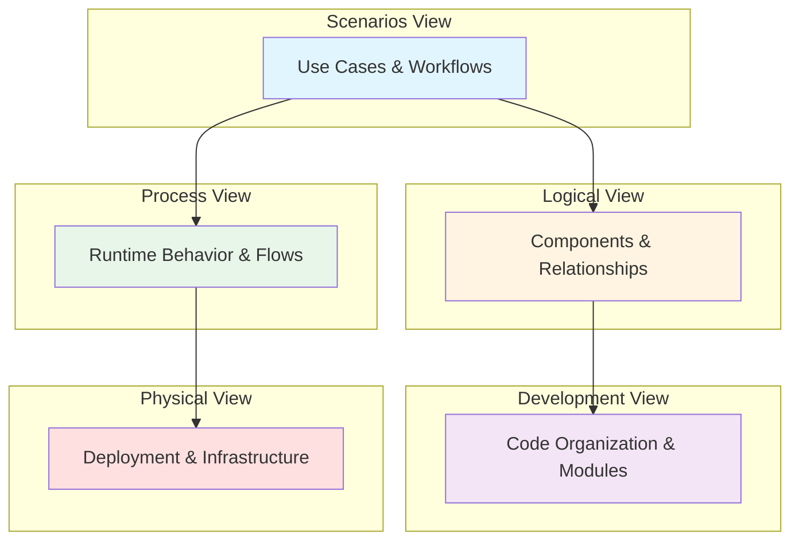
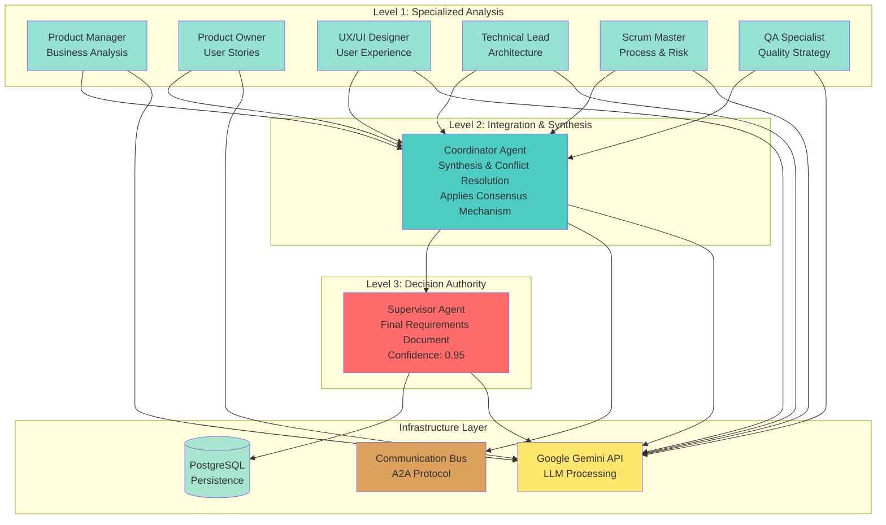
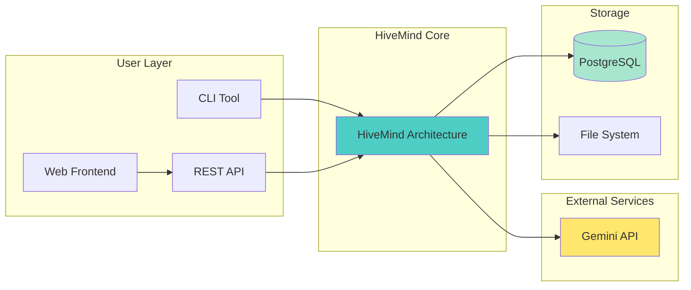

# HiveMind Architecture - 4+1 Views Overview

## Document Information

- **System**: HiveMind Multi-Agent Architecture
- **Version**: 1.0
- **Date**: November 2025
- **Architecture Model**: Philippe Kruchten's 4+1 Views
- **Status**: Production

---

## Executive Summary

This document provides a comprehensive architectural overview of the HiveMind system using the **4+1 architectural view model**. The HiveMind is a hierarchical multi-agent AI system that transforms business needs into comprehensive technical requirements through collaborative intelligence and consensus mechanisms.

The 4+1 view model provides multiple complementary perspectives of the system architecture, allowing different stakeholders to understand the system from their specific concerns:

- **Logical View**: What the system does (functionality)
- **Process View**: How the system behaves (runtime dynamics)
- **Development View**: How the system is organized (code structure)
- **Physical View**: Where the system runs (deployment)
- **Scenarios (+1)**: Why the system exists (use cases)

---

## Table of Contents

1. [Logical View](./logical-view.md) - System Components and Relationships
2. [Process View](./process-view.md) - Dynamic Behavior and Workflows
3. [Development View](./development-view.md) - Code Organization and Modules
4. [Physical View](./physical-view.md) - Deployment and Infrastructure
5. [Scenarios](./scenarios.md) - Use Cases and User Interactions

---

## System Overview

### What is HiveMind?

HiveMind is a **hierarchical multi-agent system** that leverages collective intelligence to solve complex software engineering problems. The system orchestrates 8 specialized AI agents across 3 hierarchical levels:

**Level 1 - Worker Agents (6 specialists)**:
- Product Manager Agent
- Product Owner Agent
- UX/UI Designer Agent
- Technical Lead Agent
- Scrum Master Agent
- QA Specialist Agent

**Level 2 - Coordinator Agent (1)**:
- Synthesizes worker outputs
- Resolves conflicts
- Applies consensus mechanisms

**Level 3 - Supervisor Agent (1)**:
- Makes final decisions
- Generates technical requirements document
- Ensures quality and completeness

### Core Capabilities

1. **Business Need Analysis**: Transforms high-level business descriptions into structured requirements
2. **Multi-Perspective Analysis**: Each agent provides domain-specific expertise
3. **Hierarchical Consensus**: Three-level decision-making ensures quality
4. **Methodology Adaptation**: Supports Scrum, SAFe, and Kanban methodologies
5. **Structured Output**: Generates comprehensive technical requirements in JSON format

### Key Architectural Patterns

- **Multi-Agent System (MAS)**: Distributed problem-solving through agent collaboration
- **Hierarchical Flow**: Sequential execution with explicit dependencies
- **Agent-to-Agent (A2A) Protocol**: Standardized communication between agents
- **Consensus Mechanisms**: Multiple strategies for decision-making
- **Context Preservation**: Complete traceability of decisions across levels

---

## Architectural Drivers

### Business Goals

- **Speed**: Generate comprehensive requirements in 30-60 seconds
- **Quality**: Ensure completeness through multi-perspective analysis
- **Consistency**: Apply methodology-specific best practices
- **Traceability**: Maintain full audit trail of decisions

### Technical Constraints

- **LLM Integration**: Uses Google Gemini API for all agents
- **Scalability**: Designed for horizontal scaling (more agents)
- **Extensibility**: Easy to add new agents or consensus strategies
- **Deployment**: Docker-based containerization

### Quality Attributes

- **Reliability**: Robust error handling and retry mechanisms
- **Performance**: Parallel processing where possible
- **Maintainability**: Clean separation of concerns
- **Testability**: Unit and integration tests for all components

---

## Stakeholder Concerns

### Product Managers & Business Analysts
- **Primary View**: [Scenarios](./scenarios.md)
- **Concerns**: Use cases, business value, user workflows
- **Secondary**: [Logical View](./logical-view.md) for feature understanding

### Software Architects & Technical Leads
- **Primary View**: [Logical View](./logical-view.md)
- **Concerns**: Component design, patterns, extensibility
- **Secondary**: [Process View](./process-view.md) for runtime behavior

### Software Developers
- **Primary View**: [Development View](./development-view.md)
- **Concerns**: Code organization, modules, dependencies
- **Secondary**: [Logical View](./logical-view.md) for component interfaces

### DevOps & Infrastructure Engineers
- **Primary View**: [Physical View](./physical-view.md)
- **Concerns**: Deployment, scaling, monitoring
- **Secondary**: [Process View](./process-view.md) for runtime characteristics

### QA Engineers & Testers
- **Primary View**: [Scenarios](./scenarios.md)
- **Concerns**: Test cases, quality gates, validation
- **Secondary**: [Process View](./process-view.md) for testing integration points

---

## Architecture at a Glance

### Hierarchical Architecture Diagram

---

## System Context

### External Interfaces

1. **User Interfaces**:
   - CLI (Command Line Interface)
   - REST API (FastAPI)
   - Web Frontend (React)

2. **External Services**:
   - Google Gemini API (LLM processing)

3. **Data Storage**:
   - PostgreSQL (analysis persistence)
   - File System (logs and outputs)

### Integration Points

---

## Architectural Decisions

### ADR-001: Three-Level Hierarchical Architecture

**Decision**: Use a three-level hierarchy (Workers, Coordinator, Supervisor)

**Rationale**:
- Level 1 ensures diverse, specialized perspectives
- Level 2 provides synthesis without losing nuance
- Level 3 offers authoritative final decision
- More levels add complexity without value
- Fewer levels lose synthesis benefits

**Status**: Accepted

---

### ADR-002: Sequential Hierarchical Flow for Workers

**Decision**: Execute workers sequentially following Product Management dependencies

**Rationale**:
- Respects natural workflow dependencies (Business → Product → UX → Tech → Process → QA)
- Preserves context between phases
- Enables quality gates at each phase
- Aligns with real-world development processes

**Status**: Accepted

---

### ADR-003: Multi-Methodology Support

**Decision**: Support Scrum, SAFe, and Kanban with methodology-aware agents

**Rationale**:
- Organizations use different methodologies
- Agents adapt terminology and artifacts per methodology
- Enables flexible deployment across contexts
- Maintains consistency within chosen methodology

**Status**: Accepted

---

### ADR-004: A2A Communication Protocol

**Decision**: Implement Agent-to-Agent protocol for all inter-agent communication

**Rationale**:
- Provides traceability of all decisions
- Enables communication analytics
- Supports debugging and auditing
- Allows future extensions (message queuing, distributed agents)

**Status**: Accepted

---

### ADR-005: PostgreSQL for Persistence

**Decision**: Use PostgreSQL for analysis and response storage

**Rationale**:
- Structured relational data (analyses, agent responses)
- Complex queries support (filtering, search)
- ACID compliance ensures integrity
- Mature ecosystem and tooling

**Status**: Accepted

---

## Technology Stack Summary

| Layer | Technology | Purpose |
|-------|-----------|---------|
| **Frontend** | React + Vite | Modern web UI |
| **API** | FastAPI + Uvicorn | High-performance REST API |
| **Backend** | Python 3.11+ | Core orchestration logic |
| **LLM** | Google Gemini API | AI agent intelligence |
| **Database** | PostgreSQL 16 | Persistent storage |
| **Communication** | A2A Protocol | Agent messaging |
| **Consensus** | Multiple strategies | Decision-making |
| **Deployment** | Docker + Docker Compose | Containerization |
| **Web Server** | Nginx | Static file serving |

---

## Documentation Navigation

### For Getting Started
1. Start with [Scenarios](./scenarios.md) to understand use cases
2. Review [Logical View](./logical-view.md) for component overview
3. Check [Development View](./development-view.md) for code structure

### For Deep Technical Understanding
1. Read [Logical View](./logical-view.md) for detailed component design
2. Study [Process View](./process-view.md) for runtime behavior
3. Review [Development View](./development-view.md) for implementation details

### For Deployment
1. Refer to [Physical View](./physical-view.md) for infrastructure
2. Check deployment documentation for specific setup
3. Review monitoring and scaling guidance

---

## Version History

| Version | Date | Author | Changes |
|---------|------|--------|---------|
| 1.0 | Nov 2025 | HiveMind Team | Initial 4+1 architecture documentation |

---

## References

- Philippe Kruchten (1995). "The 4+1 View Model of Architecture"
- Multi-Agent Systems: An Introduction to Distributed Artificial Intelligence
- Google Gemini API Documentation
- FastAPI Framework Documentation
- Docker Deployment Best Practices

---

## Next Steps

Choose your view based on your role:

- **Business/Product**: Start with [Scenarios](./scenarios.md)
- **Architecture/Design**: Start with [Logical View](./logical-view.md)
- **Development**: Start with [Development View](./development-view.md)
- **Operations**: Start with [Physical View](./physical-view.md)
- **QA/Testing**: Start with [Process View](./process-view.md)
