# Process View - HiveMind Architecture

## Overview

The **Process View** describes the system's dynamic behavior, showing how components interact at runtime, how processes are organized, and how the system achieves concurrency and synchronization. This view addresses **how** the system behaves during execution.

**Target Audience**: Software Architects, Performance Engineers, QA Engineers, Operations

---

## Table of Contents

1. [Execution Model](#execution-model)
2. [Main Process Flow](#main-process-flow)
3. [Hierarchical Execution Flow](#hierarchical-execution-flow)
4. [Communication Patterns](#communication-patterns)
5. [Consensus Process](#consensus-process)
6. [State Transitions](#state-transitions)
7. [Concurrency and Threading](#concurrency-and-threading)
8. [Error Handling and Recovery](#error-handling-and-recovery)
9. [Performance Characteristics](#performance-characteristics)

---

## Execution Model

### System Execution Paradigm

The HiveMind system follows a **hierarchical synchronous execution model** with three distinct phases:

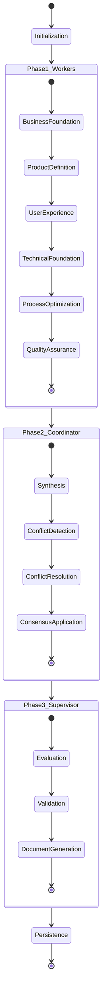

### Execution Characteristics

| Characteristic | Description |
|---------------|-------------|
| **Execution Mode** | Synchronous, sequential |
| **Concurrency Level** | Single-threaded orchestration, parallel LLM calls |
| **Process Duration** | 30-60 seconds typical |
| **State Management** | In-memory with persistence at end |
| **Error Handling** | Fail-fast with comprehensive logging |

---

## Main Process Flow

### Complete End-to-End Flow

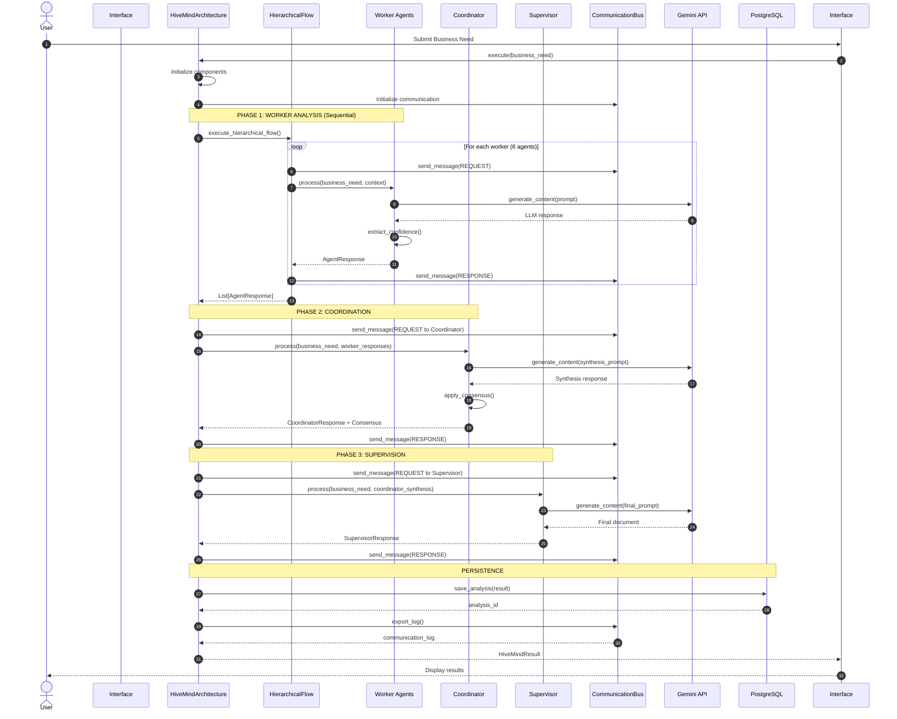

### Process Breakdown

#### 1. Initialization Phase (Steps 1-3)
**Duration**: < 1 second
**Activities**:
- Load configuration
- Initialize Gemini client
- Create methodology context
- Initialize communication bus
- Instantiate all agents

**Outputs**:
- Configured HiveMindArchitecture
- Ready-to-execute system

---

#### 2. Phase 1: Worker Analysis (Steps 4-10)
**Duration**: 20-35 seconds
**Activities**:
- Sequential execution of 6 worker agents
- Each agent analyzes from their domain perspective
- Context preserved and passed between agents
- All communication logged to bus

**Sequence Details**:

##### Step 1: Business Foundation (ProductManager)
```python
Input: Business need + Methodology context
Dependencies: None
Processing: Business viability, market analysis, stakeholders
Output: Business analysis + Confidence score
Duration: 3-5 seconds
```

##### Step 2: Product Definition (ProductOwner)
```python
Input: Business need + ProductManager output
Dependencies: Business Foundation complete
Processing: User stories, backlog, INVEST criteria
Output: User stories + Product backlog + Confidence
Duration: 4-6 seconds
```

##### Step 3: User Experience (UX/UI Designer)
```python
Input: Business need + ProductOwner output
Dependencies: Product Definition complete
Processing: Journey maps, wireframes, design system
Output: UX design + Wireframes + Confidence
Duration: 3-5 seconds
```

##### Step 4: Technical Foundation (Technical Lead)
```python
Input: Business need + UX/UI output
Dependencies: User Experience complete
Processing: Architecture, tech stack, NFRs
Output: Architecture design + Tech stack + Confidence
Duration: 4-6 seconds
```

##### Step 5: Process Optimization (Scrum Master)
```python
Input: Business need + Technical Lead output
Dependencies: Technical Foundation complete
Processing: Sprint planning, ceremonies, RAID
Output: Process plan + Risk analysis + Confidence
Duration: 3-5 seconds
```

##### Step 6: Quality Assurance (QA Specialist)
```python
Input: Business need + Scrum Master output
Dependencies: Process Optimization complete
Processing: Test strategy, coverage, automation
Output: Quality plan + Test strategy + Confidence
Duration: 3-5 seconds
```

**Phase 1 Output**:
- 6 AgentResponse objects
- Complete communication log
- Preserved context for Phase 2

---

#### 3. Phase 2: Coordination & Consensus (Steps 11-15)
**Duration**: 5-10 seconds
**Activities**:
- Coordinator synthesizes 6 worker outputs
- Identifies synergies and conflicts
- Applies consensus mechanism
- Generates integrated view

**Process Flow**:
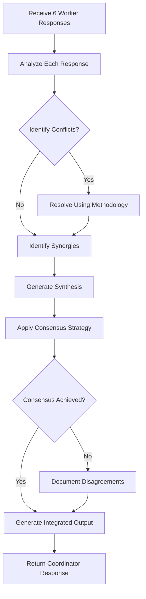

**Consensus Application**:
```python
# Example: Weighted Voting
# NOTE: These are suggested weights that can be customized based on project needs.
# By default, the system uses equal weights (1.0) for all agents unless explicitly configured.
weights = {
    "ProductManager": 1.2,      # Higher weight for business expertise
    "ProductOwner": 1.1,        # Important for product definition
    "UXUI_Designer": 1.0,       # Standard weight
    "ScrumMaster": 0.9,         # Process optimization focus
    "TechnicalLead": 1.3,       # Highest weight for technical decisions
    "QA_Specialist": 1.0        # Standard weight
}

total_weight = sum(weights.values())
weighted_confidence = sum(
    response.confidence * weights[response.agent_name]
    for response in worker_responses
)

consensus_level = weighted_confidence / total_weight
consensus_achieved = consensus_level >= threshold (0.7)
```

**Phase 2 Output**:
- CoordinatorResponse with integrated synthesis
- ConsensusResult with level and justification
- Conflict resolution documentation

---

#### 4. Phase 3: Supervision & Finalization (Steps 16-19)
**Duration**: 5-10 seconds
**Activities**:
- Supervisor evaluates coordinator synthesis
- Validates completeness and viability
- Generates final technical requirements document
- Applies final authority (confidence: 0.95)

**Validation Checks**:
1. **Completeness**: All sections present
2. **Consistency**: No contradictions
3. **Viability**: Technically feasible
4. **Methodology Compliance**: Follows selected methodology
5. **Quality Standards**: Meets requirements quality criteria

**Document Structure Generation**:
```json
{
  "document_metadata": {
    "title": "Technical Requirements Document",
    "version": "1.0",
    "methodology": "scrum",
    "generated_at": "2025-11-06T10:30:00Z"
  },
  "executive_summary": {...},
  "business_requirements": {...},
  "functional_requirements": {...},
  "non_functional_requirements": {...},
  "technical_specifications": {...},
  "ux_ui_requirements": {...},
  "quality_assurance": {...},
  "implementation_plan": {...},
  "risks_and_mitigation": [...]
}
```

**Phase 3 Output**:
- Complete technical requirements document (JSON)
- Executive summary
- Implementation roadmap
- Final confidence score

---

#### 5. Persistence Phase (Steps 20-23)
**Duration**: < 1 second
**Activities**:
- Save complete analysis to PostgreSQL
- Store all agent responses
- Export communication log
- Generate analysis ID

**Database Operations**:
```sql
-- Insert analysis
INSERT INTO analyses (
    business_need,
    methodology,
    consensus_strategy,
    execution_time,
    consensus_level,
    final_confidence,
    results_json
) VALUES (...);

-- Insert agent responses
INSERT INTO agent_responses (
    analysis_id,
    agent_name,
    agent_role,
    confidence,
    content,
    metadata
) VALUES (...);
```

**Persistence Output**:
- analysis_id (unique identifier)
- Stored in database for history/retrieval

---

## Hierarchical Execution Flow

### Dependency-Based Sequential Execution

The hierarchical flow enforces a specific order based on Product Management best practices:

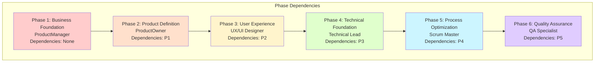

### Context Flow Between Phases

```mermaid
flowchart LR
    subgraph Input
        BN[Business Need]
        MC[Methodology Context]
    end

    subgraph P1_Output
        BA[Business Analysis]
        C1[Confidence: 0.89]
    end

    subgraph P2_Output
        US[User Stories]
        C2[Confidence: 0.92]
    end

    subgraph P3_Output
        UX[UX Design]
        C3[Confidence: 0.85]
    end

    subgraph P4_Output
        ARCH[Architecture]
        C4[Confidence: 0.91]
    end

    subgraph P5_Output
        PROC[Process Plan]
        C5[Confidence: 0.88]
    end

    subgraph P6_Output
        QA[Quality Strategy]
        C6[Confidence: 0.87]
    end

    Input --> P1_Output
    P1_Output --> P2_Output
    P2_Output --> P3_Output
    P3_Output --> P4_Output
    P4_Output --> P5_Output
    P5_Output --> P6_Output
```

### Quality Gates

Each phase includes quality gates:

```python
def validate_phase_output(phase, response, context):
    """Validate phase output before proceeding."""

    checks = []

    # 1. Confidence threshold
    checks.append(response.confidence >= 0.5)

    # 2. Content completeness
    checks.append(len(response.content) > 100)

    # 3. Dependency satisfaction
    for dep in phase.depends_on:
        checks.append(dep in context.completed_phases)

    # 4. Methodology compliance
    checks.append(validate_methodology(response, context.methodology))

    return all(checks)
```

---

## Communication Patterns

### A2A Protocol Flow

All agent communication follows the Agent-to-Agent (A2A) protocol:

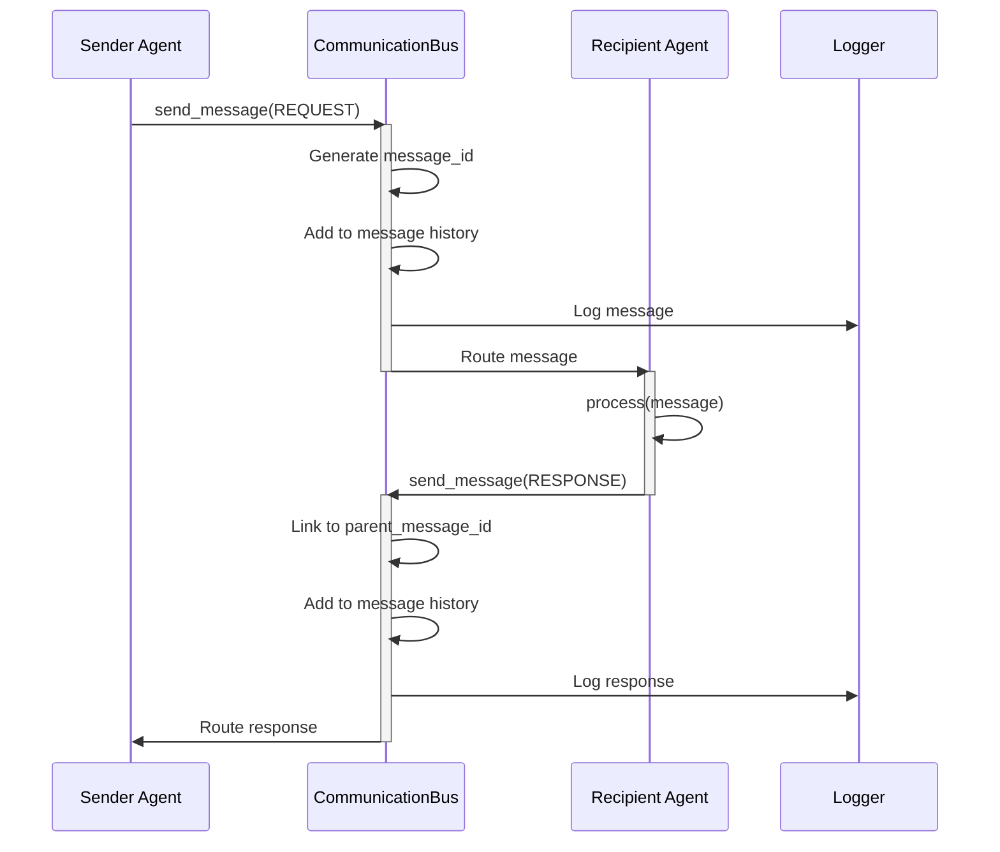

### Message Types and Usage

| Message Type | Sender | Recipient | Usage |
|-------------|--------|-----------|-------|
| REQUEST | System/Agent | Agent | Request processing |
| RESPONSE | Agent | System/Agent | Return results |
| NOTIFICATION | Agent | System | Status updates |
| ERROR | Agent | System | Error reporting |

### Communication Statistics

The CommunicationBus tracks:
- Total messages sent
- Messages by type
- Messages by priority
- Agent participation
- Message threads
- Timeline of communication

---

## Consensus Process

### Consensus Flow Diagram

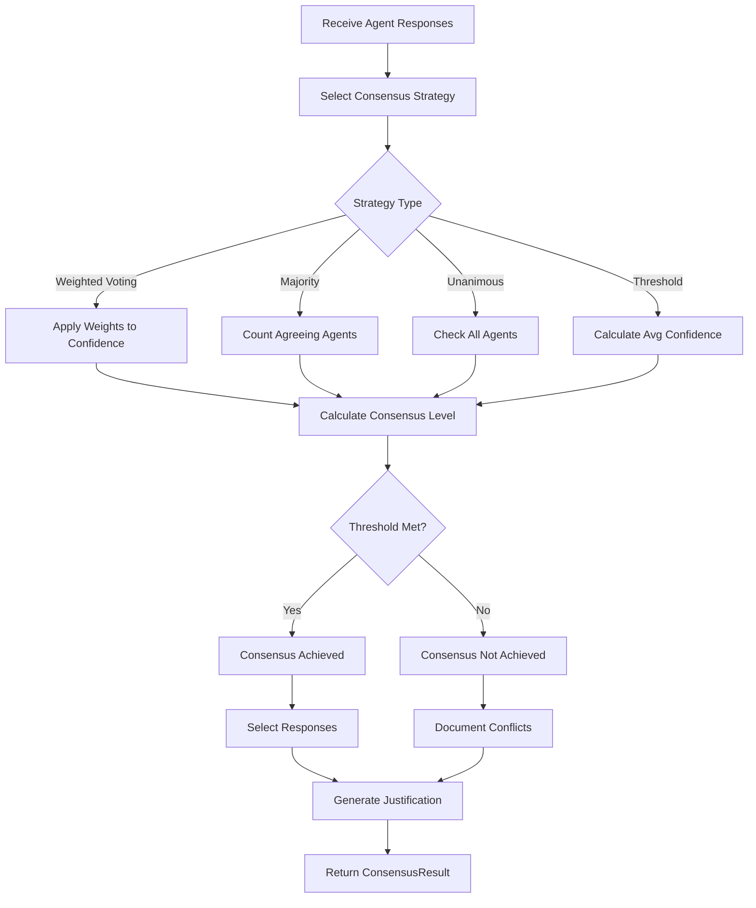

### Weighted Voting Detailed Process

```python
def weighted_voting_consensus(responses, weights, threshold=0.7):
    """
    Apply weighted voting consensus.

    Args:
        responses: List of AgentResponse objects
        weights: Dict mapping agent_name to weight
        threshold: Minimum consensus level required

    Returns:
        ConsensusResult
    """

    # Calculate weighted sum
    total_weight = 0
    weighted_confidence = 0

    for response in responses:
        weight = weights.get(response.agent_name, 1.0)
        total_weight += weight
        weighted_confidence += response.confidence * weight

    # Calculate consensus level
    consensus_level = weighted_confidence / total_weight

    # Determine achievement
    achieved = consensus_level >= threshold

    # Classify responses
    selected = [r for r in responses if r.confidence >= threshold]
    conflicting = [r for r in responses if r.confidence < threshold]

    # Generate justification
    justification = f"""
    Weighted voting consensus {'achieved' if achieved else 'not achieved'}.
    Consensus level: {consensus_level:.2%}
    Threshold: {threshold:.2%}
    Agreeing agents: {len(selected)}/{len(responses)}
    """

    return ConsensusResult(
        achieved=achieved,
        strategy_used=ConsensusStrategy.WEIGHTED_VOTING,
        consensus_level=consensus_level,
        selected_responses=selected,
        conflicting_responses=conflicting,
        justification=justification.strip()
    )
```

---

## State Transitions

### System State Machine

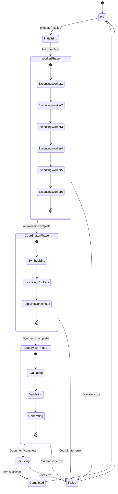

### Agent State Transitions

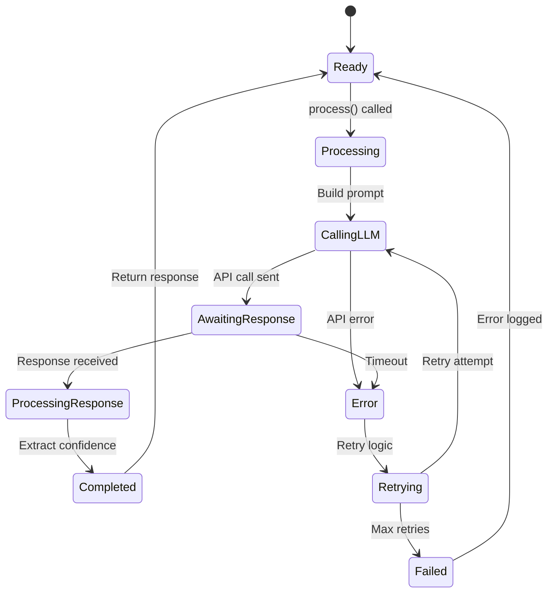

---

## Concurrency and Threading

### Current Concurrency Model

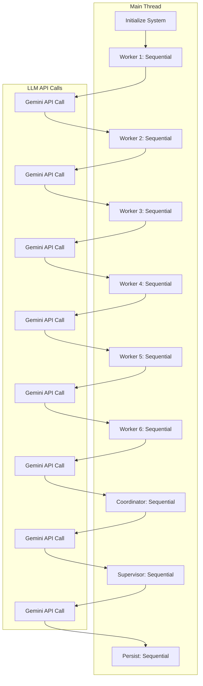

**Characteristics**:
- Single-threaded orchestration
- Sequential agent execution
- Synchronous LLM API calls
- No parallel processing currently

### Future Concurrency Enhancements

**Potential improvements**:

1. **Parallel Independent Workers**:
```python
# Workers without dependencies can run in parallel
parallel_workers = [ProductManager, QA_Specialist]
results = await asyncio.gather(*[
    worker.process_async(business_need)
    for worker in parallel_workers
])
```

2. **Async LLM Calls**:
```python
async def process_async(self, input_data, context):
    """Async processing with non-blocking LLM calls."""
    response = await self.gemini_client.generate_content_async(
        prompt=self._build_prompt(input_data, context)
    )
    return self._create_response(response)
```

3. **Streaming Responses**:
```python
async def process_stream(self, input_data, context):
    """Stream responses as they're generated."""
    async for chunk in self.gemini_client.stream_content(prompt):
        yield chunk
```

---

## Error Handling and Recovery

### Error Handling Strategy

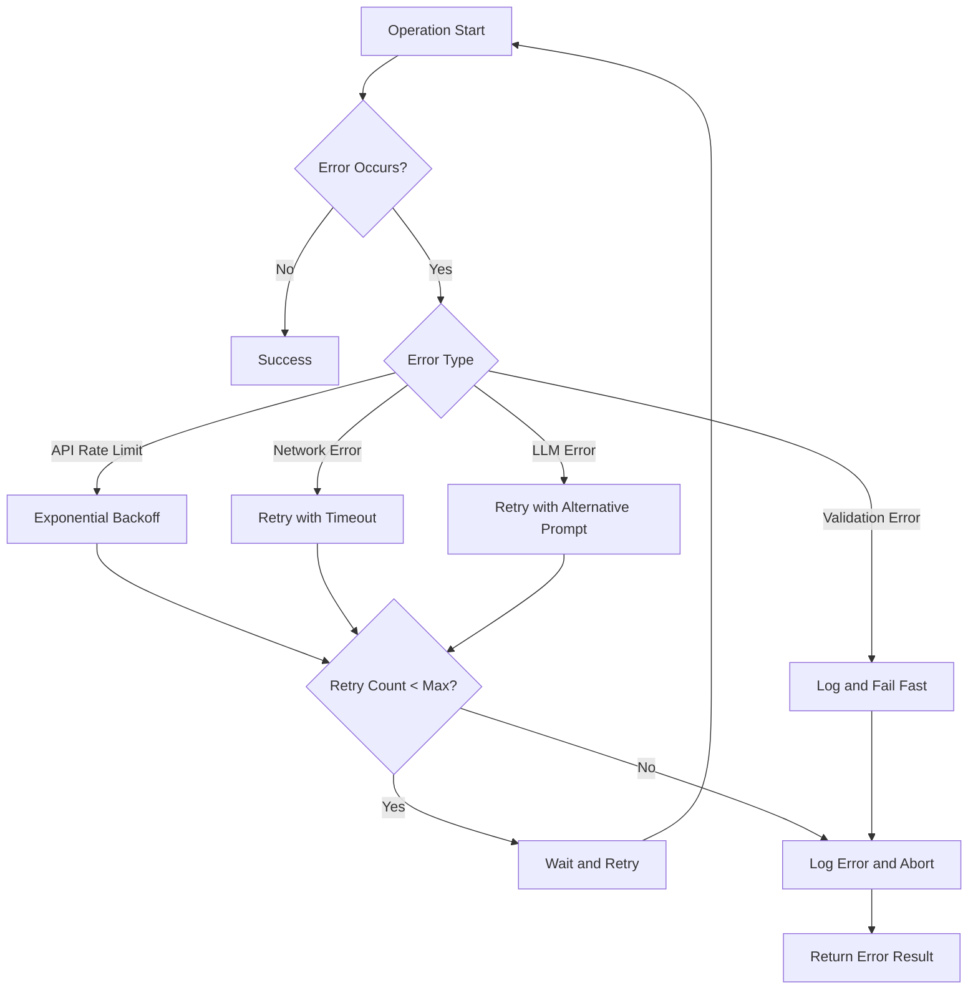

### Error Handling Levels

#### 1. Component-Level Errors
```python
try:
    response = self.gemini_client.generate_content(prompt)
except RateLimitError:
    # Exponential backoff
    time.sleep(2 ** retry_count)
    retry_count += 1
    if retry_count < max_retries:
        return self._call_gemini_with_retry(prompt, retry_count)
    else:
        raise
except TimeoutError:
    # Log and retry
    logger.error(f"Timeout calling Gemini API for {self.name}")
    raise
```

#### 2. Phase-Level Errors
```python
try:
    worker_responses = self._execute_workers(business_need)
except AgentError as e:
    logger.error(f"Worker phase failed: {str(e)}")
    # Attempt recovery or abort
    if is_recoverable(e):
        return self._retry_worker_phase(business_need)
    else:
        raise
```

#### 3. System-Level Errors
```python
try:
    result = hivemind.execute(business_need)
except Exception as e:
    logger.critical(f"System execution failed: {str(e)}")
    # Save partial results if available
    if partial_results:
        self._save_partial_results(partial_results)
    # Notify user of failure
    return ErrorResult(error=str(e), partial_data=partial_results)
```

### Retry Mechanisms

#### Exponential Backoff
```python
def exponential_backoff(retry_count, base_delay=1, max_delay=60):
    """Calculate backoff delay with jitter."""
    delay = min(base_delay * (2 ** retry_count), max_delay)
    jitter = random.uniform(0, delay * 0.1)
    return delay + jitter
```

#### Circuit Breaker Pattern
```python
class CircuitBreaker:
    def __init__(self, failure_threshold=5, timeout=60):
        self.failure_count = 0
        self.failure_threshold = failure_threshold
        self.timeout = timeout
        self.state = "closed"  # closed, open, half_open
        self.last_failure_time = None

    def call(self, func):
        if self.state == "open":
            if time.time() - self.last_failure_time > self.timeout:
                self.state = "half_open"
            else:
                raise CircuitBreakerOpen()

        try:
            result = func()
            if self.state == "half_open":
                self.state = "closed"
                self.failure_count = 0
            return result
        except Exception as e:
            self.failure_count += 1
            self.last_failure_time = time.time()
            if self.failure_count >= self.failure_threshold:
                self.state = "open"
            raise
```

---

## Performance Characteristics

### Execution Time Breakdown

Typical execution profile for a standard analysis:

| Phase | Duration | Percentage | Parallelizable |
|-------|----------|------------|----------------|
| Initialization | 0.5s | 1% | No |
| Worker 1 (PM) | 4s | 8% | No |
| Worker 2 (PO) | 5s | 10% | Partial |
| Worker 3 (UX) | 4s | 8% | Partial |
| Worker 4 (TL) | 5s | 10% | No |
| Worker 5 (SM) | 4s | 8% | No |
| Worker 6 (QA) | 4s | 8% | Partial |
| Coordinator | 8s | 16% | No |
| Supervisor | 9s | 18% | No |
| Persistence | 0.5s | 1% | No |
| **Total** | **50s** | **100%** | **~25% potential** |

### Performance Optimization Opportunities

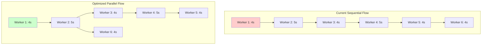

**Potential Speedup**:
- Current: 26s for workers
- Optimized: ~15s for workers (42% reduction)
- Total savings: ~11s (22% overall)

### Resource Utilization

```python
# Typical resource usage
{
    "cpu_usage": "Low (5-10%)",  # Mostly I/O bound
    "memory_usage": "50-100 MB",  # Small in-memory state
    "network_bandwidth": "Moderate",  # LLM API calls
    "llm_api_calls": 8,  # 6 workers + coordinator + supervisor
    "tokens_used": "15,000-25,000",  # Per execution
    "database_connections": 1,  # Single connection
    "api_rate_limit_impact": "Moderate"  # Gemini rate limits
}
```

### Scalability Analysis

#### Vertical Scaling
- **CPU**: Not beneficial (I/O bound)
- **Memory**: Minimal impact (already efficient)
- **Network**: Helps with API latency

#### Horizontal Scaling
- **Agent Distribution**: High potential
- **Database Sharding**: Low benefit (small data)
- **Load Balancing**: Beneficial for API endpoint

#### Performance Bottlenecks

1. **LLM API Latency** (70% of time):
   - Mitigation: Parallel calls where possible
   - Mitigation: Response caching
   - Mitigation: Optimized prompts

2. **Sequential Execution** (20% of time):
   - Mitigation: Partial parallelization
   - Mitigation: Async/await implementation

3. **Database I/O** (5% of time):
   - Mitigation: Batch inserts
   - Mitigation: Connection pooling

4. **Context Building** (5% of time):
   - Mitigation: Efficient serialization
   - Mitigation: Context summarization

---

## Monitoring and Observability

### Key Metrics to Track

```python
metrics = {
    "execution_time": {
        "total": 50.2,
        "phase_1_workers": 26.5,
        "phase_2_coordinator": 8.3,
        "phase_3_supervisor": 9.1,
        "persistence": 0.5
    },
    "agent_performance": {
        "ProductManager": {"duration": 4.2, "confidence": 0.89},
        "ProductOwner": {"duration": 5.1, "confidence": 0.92},
        # ... other agents
    },
    "consensus": {
        "level": 0.887,
        "strategy": "weighted_voting",
        "achieved": True
    },
    "communication": {
        "total_messages": 24,
        "by_type": {"REQUEST": 8, "RESPONSE": 16},
        "by_priority": {"HIGH": 4, "MEDIUM": 20}
    },
    "llm_usage": {
        "api_calls": 8,
        "tokens_used": 18450,
        "estimated_cost": 0.037
    }
}
```

### Logging Strategy

```python
# Structured logging at each level
logger.info("HiveMind execution started", extra={
    "business_need_length": len(business_need),
    "methodology": methodology.value,
    "consensus_strategy": strategy.value
})

logger.info("Worker phase complete", extra={
    "agent": agent.name,
    "confidence": response.confidence,
    "duration": duration,
    "token_count": token_count
})

logger.info("HiveMind execution complete", extra={
    "total_duration": execution_time,
    "consensus_level": consensus_result.consensus_level,
    "final_confidence": supervisor_response.confidence
})
```

---

## References

- Process View in 4+1 Architecture (Kruchten)
- Patterns of Enterprise Application Architecture (Fowler)
- Site Reliability Engineering (Google)

---

**Next**: [Development View →](./development-view.md)
