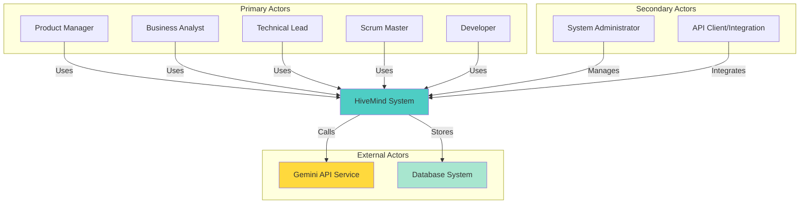
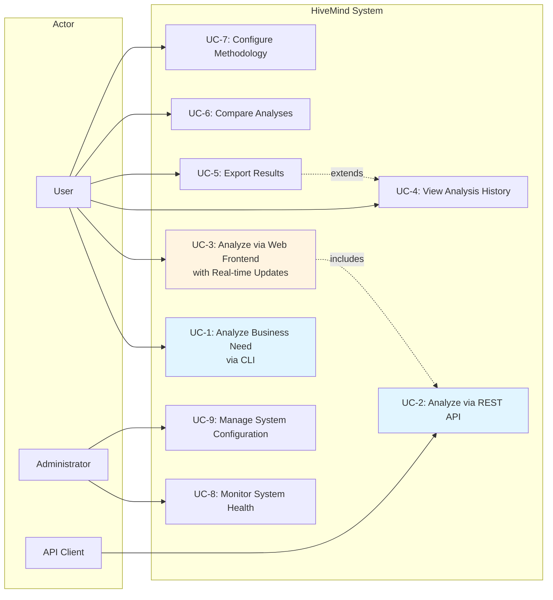
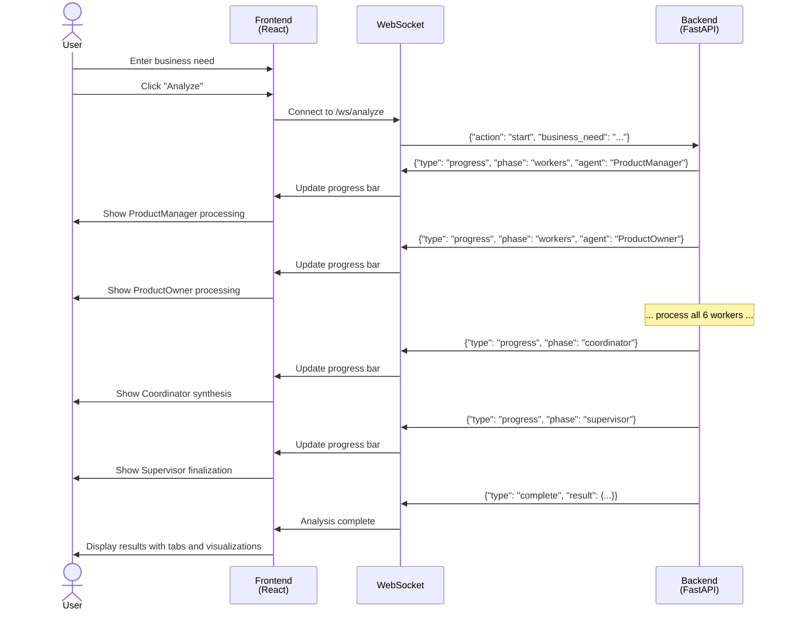
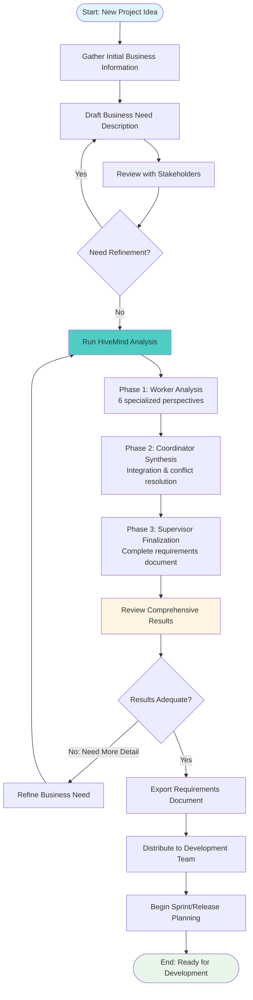
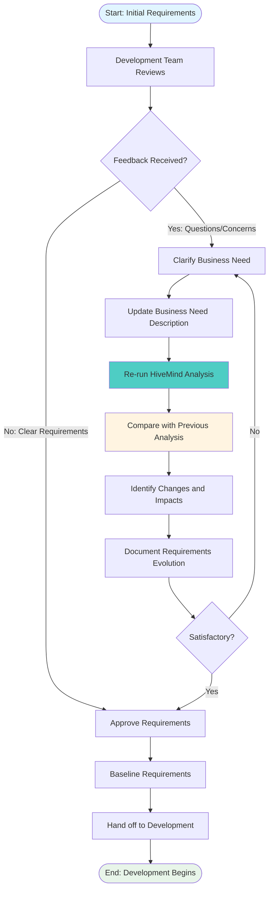
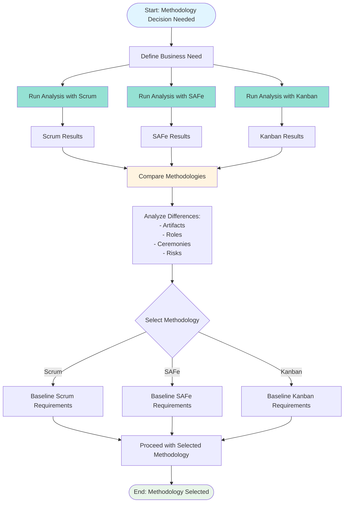

# Scenarios - HiveMind Architecture (+1 View)

## Overview

The **Scenarios View** (the "+1" in 4+1) describes the system's behavior from the end-user perspective through use cases and workflows. This view validates that the architecture supports all required scenarios and serves as the "glue" connecting the other four views.

**Target Audience**: Product Managers, Business Analysts, QA Engineers, End Users

---

## Table of Contents

1. [Use Case Model](#use-case-model)
2. [Primary Use Cases](#primary-use-cases)
3. [User Workflows](#user-workflows)
4. [Integration Scenarios](#integration-scenarios)
5. [Error and Edge Cases](#error-and-edge-cases)
6. [Performance Scenarios](#performance-scenarios)
7. [Security Scenarios](#security-scenarios)

---

## Use Case Model

### Actors



### Use Case Diagram



---

## Primary Use Cases

### UC-1: Analyze Business Need via CLI

**ID**: UC-1
**Priority**: High
**Actors**: Product Manager, Business Analyst, Technical Lead
**Preconditions**:
- System is installed and configured
- GEMINI_API_KEY is set in environment
- User has CLI access

**Main Flow**:
1. User opens terminal
2. User executes: `python backend/cli.py`
3. System prompts for business need input
4. User enters or pastes business need description
5. User selects methodology (Scrum/SAFe/Kanban)
6. User selects consensus strategy
7. System displays progress for each phase:
   - Phase 1: Worker Agents (6 specialists)
   - Phase 2: Coordinator Synthesis
   - Phase 3: Supervisor Finalization
8. System displays completion summary with:
   - Execution time
   - Consensus level
   - Final confidence score
9. System saves results to `/output` directory as JSON
10. User reviews generated requirements document

**Alternative Flows**:
- **A1: Input from File**
  - At step 3, user provides `--input business_need.txt`
  - System reads business need from file
  - Continue at step 5

- **A2: Custom Output Path**
  - At step 3, user provides `--output custom_path.json`
  - System saves results to custom path at step 9

- **A3: Quiet Mode**
  - At step 3, user provides `--quiet` flag
  - System suppresses progress output (steps 7-8)
  - Only final summary shown

**Exception Flows**:
- **E1: Invalid API Key**
  - At step 7, Gemini API returns authentication error
  - System displays: "Invalid GEMINI_API_KEY"
  - Execution aborts
  - User must configure API key and retry

- **E2: Network Timeout**
  - During step 7, network connection fails
  - System retries with exponential backoff
  - If max retries exceeded, display error
  - Save partial results if available

- **E3: Insufficient Business Need Details**
  - At step 7, workers return low confidence (<0.5)
  - System warns user about incomplete analysis
  - User can abort or continue with warning

**Postconditions**:
- Technical requirements document generated
- Results saved to file system
- Analysis logged to database (if configured)
- Communication log exported

**Example**:
```bash
$ python backend/cli.py

🐝 HiveMind Architecture - Discovery to Technical Requirements
═══════════════════════════════════════════════════════════════

Enter business need (or press Ctrl+D when done):
We need to build a mobile-first e-commerce platform for sustainable
fashion brands. The platform should connect conscious consumers with
eco-friendly clothing brands, provide detailed product information
about sustainability metrics, and include a community feature for
sharing sustainable fashion tips.

Select methodology:
1. Scrum (Sprint-based)
2. SAFe (Scaled Agile)
3. Kanban (Continuous Flow)
Choice [1-3]: 1

Select consensus strategy:
1. Weighted Voting (default)
2. Majority
3. Unanimous
4. Confidence Threshold
Choice [1-4]: 1

[PHASE 1: Worker Agents Analysis]
  → ProductManager: Processing... ✓ (Confidence: 0.89)
  → ProductOwner: Processing... ✓ (Confidence: 0.92)
  → UXUI_Designer: Processing... ✓ (Confidence: 0.85)
  → TechnicalLead: Processing... ✓ (Confidence: 0.91)
  → ScrumMaster: Processing... ✓ (Confidence: 0.88)
  → QA_Specialist: Processing... ✓ (Confidence: 0.87)

[PHASE 2: Coordinator Synthesis]
  → Coordinator: Synthesizing 6 worker responses... ✓
  → Applying consensus strategy: weighted_voting... ✓ (Level: 88.7%)

[PHASE 3: Supervisor - Final Requirements]
  → Supervisor: Generating final technical requirements... ✓

═══════════════════════════════════════════════════════════════
✅ HIVEMIND EXECUTION COMPLETED
═══════════════════════════════════════════════════════════════
⏱  Execution Time: 48.32s
📊 Consensus Level: 88.7%
🎯 Final Confidence: 95.0%
💾 Results saved to: output/analysis_20251106_103045.json

View full requirements document at the path above.
```

---

### UC-2: Analyze via REST API

**ID**: UC-2
**Priority**: High
**Actors**: API Client, External System, Developer
**Preconditions**:
- Backend API server is running
- Client has network access to API endpoint
- API is healthy and responding

**Main Flow**:
1. Client prepares request payload with:
   - business_need (required)
   - methodology (optional, default: "scrum")
   - consensus_strategy (optional, default: "weighted_voting")
   - verbose (optional, default: false)
2. Client sends POST request to `/api/v1/analyze`
3. API validates request payload
4. API initiates HiveMind execution
5. API returns HTTP 202 (Accepted) or waits for completion
6. Upon completion, API returns HTTP 200 with:
   - Complete HiveMindResult
   - Worker responses
   - Coordinator synthesis
   - Supervisor final document
   - Consensus result
   - Execution metadata
7. API persists analysis to database
8. Client processes response

**Alternative Flows**:
- **A1: Asynchronous Execution**
  - At step 5, API returns immediately with job_id
  - Client polls `/api/v1/analyses/{job_id}` for status
  - When complete, retrieve results

- **A2: Streaming via WebSocket**
  - Client connects to `/api/v1/ws/analyze`
  - API streams progress updates in real-time
  - Client receives incremental updates
  - Final result delivered via WebSocket

**Exception Flows**:
- **E1: Invalid Request**
  - At step 3, validation fails
  - API returns HTTP 422 with validation errors
  - Client corrects and retries

- **E2: Server Error**
  - During step 4, execution fails
  - API returns HTTP 500 with error details
  - Partial results included if available
  - Client logs error and alerts user

- **E3: Rate Limiting**
  - At step 3, rate limit exceeded
  - API returns HTTP 429 with retry-after header
  - Client waits and retries

**Postconditions**:
- Analysis completed and persisted
- Response returned to client
- Metrics logged for monitoring

**Example Request**:
```bash
curl -X POST http://localhost:8000/api/v1/analyze \
  -H "Content-Type: application/json" \
  -d '{
    "business_need": "Build a telemedicine platform for remote patient consultations",
    "methodology": "scrum",
    "consensus_strategy": "weighted_voting",
    "verbose": true
  }'
```

**Example Response**:
```json
{
  "success": true,
  "analysis_id": "abc123xyz",
  "execution_time": 47.8,
  "consensus_result": {
    "achieved": true,
    "strategy_used": "weighted_voting",
    "consensus_level": 0.887,
    "justification": "Weighted voting consensus achieved..."
  },
  "supervisor_response": {
    "agent_name": "Supervisor",
    "confidence": 0.95,
    "content": "{...comprehensive technical requirements...}",
    "timestamp": "2025-11-06T10:35:22Z"
  },
  "metadata": {
    "methodology": "scrum",
    "total_agents": 8,
    "worker_count": 6
  }
}
```

---

### UC-3: Analyze via Web Frontend with Real-time Updates

**ID**: UC-3
**Priority**: High
**Actors**: Product Manager, Business Analyst
**Preconditions**:
- Frontend application is accessible
- Backend API is running and healthy
- User has web browser

**Main Flow**:
1. User navigates to frontend application (http://localhost:3002)
2. User lands on Dashboard page
3. User clicks "New Analysis" or navigates to Analyze page
4. User enters business need in text area
5. User selects methodology from dropdown
6. User selects consensus strategy
7. User clicks "Analyze" button
8. Frontend establishes WebSocket connection to backend
9. Backend initiates HiveMind execution
10. Frontend displays real-time progress:
    - Current phase (Workers/Coordinator/Supervisor)
    - Current agent being processed
    - Agent completion with confidence scores
    - Progress bar showing overall completion
11. Upon completion, frontend displays:
    - Executive summary
    - Tabbed view of agent responses
    - Final requirements document
    - Consensus visualization
    - Export options (PDF/JSON/Markdown)
12. User reviews results in interactive UI
13. User can export, share, or start new analysis

**Alternative Flows**:
- **A1: View Existing Analysis**
  - At step 3, user navigates to History page
  - User selects previous analysis from list
  - System displays cached results
  - User can compare with new analysis

- **A2: Interrupted Connection**
  - During step 10, WebSocket disconnects
  - Frontend automatically reconnects
  - Backend resumes sending updates
  - No data loss

**Exception Flows**:
- **E1: Empty Business Need**
  - At step 7, validation fails
  - Frontend displays inline error: "Business need is required"
  - User must enter text before proceeding

- **E2: Analysis Failure**
  - During step 10, backend returns error
  - Frontend displays error message
  - User can view partial results if available
  - User can retry analysis

- **E3: Session Timeout**
  - During long analysis, session expires
  - Frontend prompts for re-authentication
  - Analysis continues in background
  - Results available after re-auth

**Postconditions**:
- Analysis results displayed in UI
- Results cached in browser
- Analysis saved to backend database
- User can perform follow-up actions

**UI Flow Diagram**:


---

### UC-4: View Analysis History

**ID**: UC-4
**Priority**: Medium
**Actors**: Product Manager, Business Analyst, Developer
**Preconditions**:
- Previous analyses exist in database
- User has access to system

**Main Flow**:
1. User navigates to History page/endpoint
2. System queries database for analyses
3. System displays list with:
   - Analysis ID
   - Business need summary (first 100 chars)
   - Methodology used
   - Consensus level
   - Final confidence
   - Execution time
   - Timestamp
4. User can filter by:
   - Date range
   - Methodology
   - Consensus strategy
   - Confidence threshold
5. User can sort by:
   - Date (newest/oldest)
   - Confidence (high/low)
   - Execution time
6. User selects analysis to view
7. System retrieves full analysis from database
8. System displays complete results
9. User can export or compare with other analyses

**Postconditions**:
- User has reviewed historical analysis
- No changes made to stored data

---

### UC-5: Export Results

**ID**: UC-5
**Priority**: Medium
**Actors**: Product Manager, Technical Lead
**Preconditions**:
- Analysis results are available
- User has completed analysis or viewing history

**Main Flow**:
1. User views analysis results
2. User clicks "Export" button
3. System displays export format options:
   - JSON (raw data)
   - PDF (formatted document)
   - Markdown (documentation)
   - CSV (summary data)
4. User selects format
5. User optionally customizes:
   - Include/exclude sections
   - Include/exclude agent responses
   - Include/exclude communication log
6. System generates export file
7. System provides download link
8. User downloads file

**Postconditions**:
- Export file generated and downloaded
- Original data unchanged

---

## User Workflows

### Workflow 1: Initial Project Discovery



**Duration**: 1-2 hours (including stakeholder reviews)
**Key Actions**:
1. Stakeholder interviews
2. Business need documentation
3. HiveMind analysis (30-60 seconds)
4. Results validation
5. Requirements distribution

---

### Workflow 2: Iterative Requirements Refinement



**Duration**: 30 minutes - 2 hours per iteration
**Key Actions**:
1. Team feedback collection
2. Business need refinement
3. Incremental analysis
4. Change impact analysis
5. Requirements versioning

---

### Workflow 3: Multi-Methodology Comparison



**Duration**: 2-3 minutes total (3 analyses in parallel)
**Key Actions**:
1. Single business need definition
2. Parallel analysis with 3 methodologies
3. Side-by-side comparison
4. Methodology selection decision
5. Requirements baseline

---

## Integration Scenarios

### Scenario 1: CI/CD Pipeline Integration

**Context**: Automate requirements generation as part of development workflow

**Actors**: CI/CD System, Developer, Repository

**Flow**:
```yaml
# .github/workflows/requirements-generation.yml
name: Generate Requirements

on:
  push:
    branches:
      - feature/*
    paths:
      - 'docs/business_need.md'

jobs:
  generate-requirements:
    runs-on: ubuntu-latest
    steps:
      - uses: actions/checkout@v3

      - name: Setup Python
        uses: actions/setup-python@v4
        with:
          python-version: '3.11'

      - name: Install HiveMind
        run: |
          pip install -r requirements.txt

      - name: Generate Requirements
        env:
          GEMINI_API_KEY: ${{ secrets.GEMINI_API_KEY }}
        run: |
          python backend/cli.py \
            --input docs/business_need.md \
            --output docs/technical_requirements.json \
            --methodology scrum \
            --quiet

      - name: Commit Generated Requirements
        run: |
          git config user.name "HiveMind Bot"
          git config user.email "bot@hivemind.local"
          git add docs/technical_requirements.json
          git commit -m "docs: Update technical requirements [skip ci]"
          git push

      - name: Create PR Comment
        uses: actions/github-script@v6
        with:
          script: |
            github.rest.issues.createComment({
              issue_number: context.issue.number,
              owner: context.repo.owner,
              repo: context.repo.repo,
              body: '✅ Technical requirements have been generated and updated.'
            })
```

---

### Scenario 2: JIRA Integration

**Context**: Automatically create epics and stories in JIRA from HiveMind analysis

**Flow**:
```python
# integration/jira_sync.py
import requests
from hivemind.architecture import HiveMindArchitecture

def sync_to_jira(analysis_result):
    """Sync HiveMind results to JIRA."""

    # Extract user stories from ProductOwner response
    po_response = next(
        r for r in analysis_result.worker_responses
        if r.agent_name == "ProductOwner"
    )

    # Parse user stories
    user_stories = parse_user_stories(po_response.content)

    # Create JIRA epic
    epic = create_jira_epic(
        project="PROJ",
        summary=get_business_need_summary(),
        description=analysis_result.supervisor_response.content
    )

    # Create stories under epic
    for story in user_stories:
        create_jira_story(
            project="PROJ",
            epic=epic['key'],
            summary=story['title'],
            description=story['description'],
            acceptance_criteria=story['acceptance_criteria'],
            story_points=estimate_story_points(story)
        )

    return epic['key']
```

---

### Scenario 3: Slack Notification

**Context**: Notify team when analysis completes

**Flow**:
```python
# integration/slack_notification.py
def send_slack_notification(analysis_result):
    """Send Slack notification with analysis summary."""

    message = {
        "blocks": [
            {
                "type": "header",
                "text": {
                    "type": "plain_text",
                    "text": "🐝 HiveMind Analysis Complete"
                }
            },
            {
                "type": "section",
                "fields": [
                    {
                        "type": "mrkdwn",
                        "text": f"*Consensus Level:*\n{analysis_result.consensus_result.consensus_level:.1%}"
                    },
                    {
                        "type": "mrkdwn",
                        "text": f"*Execution Time:*\n{analysis_result.execution_time:.1f}s"
                    },
                    {
                        "type": "mrkdwn",
                        "text": f"*Methodology:*\n{analysis_result.metadata['methodology']}"
                    },
                    {
                        "type": "mrkdwn",
                        "text": f"*Final Confidence:*\n{analysis_result.supervisor_response.confidence:.1%}"
                    }
                ]
            },
            {
                "type": "actions",
                "elements": [
                    {
                        "type": "button",
                        "text": {
                            "type": "plain_text",
                            "text": "View Full Results"
                        },
                        "url": f"https://hivemind.example.com/analyses/{analysis_result.metadata['analysis_id']}"
                    }
                ]
            }
        ]
    }

    requests.post(
        "https://hooks.slack.com/services/YOUR/WEBHOOK/URL",
        json=message
    )
```

---

## Error and Edge Cases

### Error Scenario 1: Insufficient Business Need Detail

**Context**: User provides very brief, vague business need

**Input Example**:
```
"Build an app"
```

**System Behavior**:
1. All 6 workers return LOW confidence (<0.5)
2. Coordinator identifies insufficient detail
3. System generates warning:
   ```
   ⚠️  LOW CONFIDENCE WARNING
   The provided business need lacks sufficient detail for comprehensive analysis.

   Confidence scores:
   - ProductManager: 0.42
   - ProductOwner: 0.38
   - UXUI_Designer: 0.35
   - TechnicalLead: 0.41
   - ScrumMaster: 0.39
   - QA_Specialist: 0.37

   Average: 0.39 (Below threshold of 0.50)

   Recommendation: Please provide more details about:
   - Target users and their needs
   - Core functionality and features
   - Business goals and success metrics
   - Technical constraints or preferences
   - Timeline and resource considerations
   ```
4. User can choose to:
   - Abort and refine input
   - Continue with low confidence results
   - Request guided questions for refinement

---

### Error Scenario 2: API Rate Limiting

**Context**: Gemini API rate limit exceeded during execution

**System Behavior**:
```python
# Worker 3 (UXUI Designer) execution
Calling Gemini API...
❌ ERROR: Rate limit exceeded

Applying exponential backoff...
Attempt 1: Waiting 2 seconds...
Attempt 1: Calling Gemini API...
❌ ERROR: Rate limit exceeded

Attempt 2: Waiting 4 seconds...
Attempt 2: Calling Gemini API...
✓ Success

Worker 3 completed with retry
```

**Recovery**:
- Automatic retry with exponential backoff
- Max retries: 3
- If all retries fail, execution aborts with partial results
- Partial results saved for review

---

### Error Scenario 3: Conflicting Agent Responses

**Context**: Agents provide contradictory recommendations

**Example**:
- **TechnicalLead**: Recommends microservices architecture
- **ProductManager**: Suggests start with monolith for faster MVP

**System Behavior**:
1. Coordinator detects conflict
2. Applies methodology context to resolve:
   ```
   CONFLICT DETECTED:
   - TechnicalLead recommends: Microservices architecture
   - ProductManager recommends: Monolithic MVP

   RESOLUTION (Scrum context):
   Following Scrum's iterative approach and ProductOwner priority:
   - Phase 1 (Sprints 1-3): Monolithic MVP for rapid delivery
   - Phase 2 (Sprints 4-6): Evaluate microservices migration
   - Decision point after MVP validation

   JUSTIFICATION:
   Aligns with Scrum values of delivering working software quickly
   while maintaining flexibility for future architectural evolution.
   ```
3. Consensus mechanism weighs both perspectives
4. Supervisor validates resolution in final document

---

## Performance Scenarios

### Performance Scenario 1: Large-Scale Enterprise Project

**Context**: Complex enterprise system with extensive requirements

**Input**: 2000-word business need description
**Expected Performance**:
- Execution time: 60-90 seconds
- Token usage: 35,000-45,000 tokens
- Memory usage: < 200 MB
- Database size: ~ 2 MB per analysis

**Optimization Strategies**:
- Prompt compression for large inputs
- Progressive context building
- Efficient prompt design

---

### Performance Scenario 2: High-Concurrency API Load

**Context**: Multiple simultaneous analyses via API

**Load**: 10 concurrent analysis requests
**Expected Performance**:
- Average response time: 50-70 seconds (single-threaded)
- With horizontal scaling (3 instances): 50-55 seconds
- Queue depth management
- Resource allocation per request

**Scaling Response**:
- Auto-scale triggers at > 80% CPU
- Add backend instances
- Database connection pooling
- Rate limiting per client

---

## Security Scenarios

### Security Scenario 1: API Key Exposure Prevention

**Context**: Prevent accidental API key exposure

**Safeguards**:
1. Environment variable storage only
2. Never logged or displayed
3. Masked in error messages
4. Excluded from exports
5. Docker secrets management

**Validation**:
```python
# Verify API key is not exposed
assert "GEMINI_API_KEY" not in str(result.to_dict())
assert api_key not in log_output
assert api_key not in error_messages
```

---

### Security Scenario 2: Input Sanitization

**Context**: Prevent injection attacks via business need input

**Protection**:
1. Input length limits (10,000 characters)
2. Malicious pattern detection
3. SQL injection prevention (parameterized queries)
4. XSS prevention (output encoding)
5. Prompt injection detection

**Example**:
```python
# Blocked input patterns
blocked_patterns = [
    r"<script>",
    r"DROP TABLE",
    r"'; DELETE FROM",
    r"IGNORE PREVIOUS INSTRUCTIONS"
]

for pattern in blocked_patterns:
    if re.search(pattern, business_need, re.IGNORECASE):
        raise ValidationError("Potentially malicious input detected")
```

---

## References

- Use Case Driven Object Modeling (Jacobson)
- Writing Effective Use Cases (Cockburn)
- User Story Mapping (Patton)
- Scenarios in Software Architecture (Kazman)

---

**Architecture Navigation**:
- [← Back to Overview](./overview.md)
- [Logical View →](./logical-view.md)
- [Process View →](./process-view.md)
- [Development View →](./development-view.md)
- [Physical View →](./physical-view.md)
